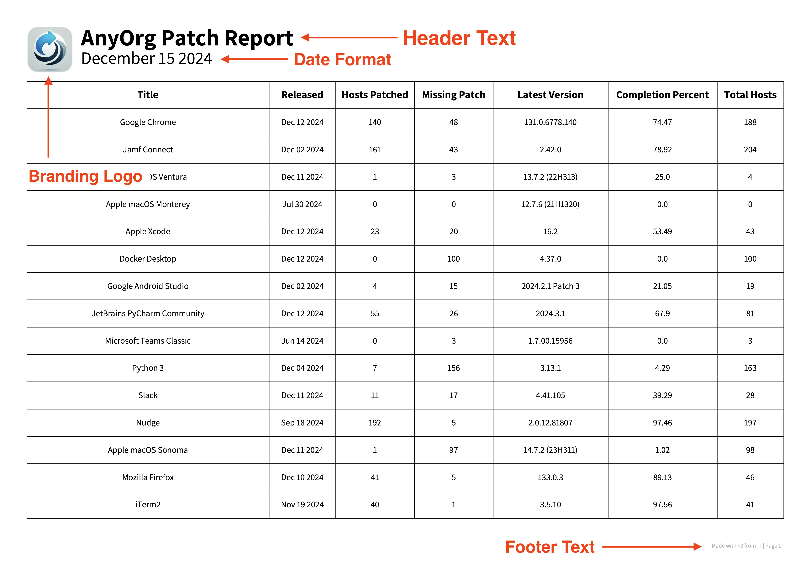

<p align="left">
    <a href="https://patcher.liquidzoo.io/">
        
    </a>
</p>

&nbsp;&nbsp;&nbsp;&nbsp;&nbsp;


----

# Patcher

_Simplified patch reporting_

<p align="left">
    
    Find us in the <code>#patcher</code> channel in the <a href="https://www.macadmins.org">MacAdmins Slack</a>
</p>

## What is Patcher?
Patcher is a Command Line Interface (CLI) tool for macOS that leverages the Jamf Pro API to fetch patch management data and generates comprehensive reports in varying formats. It simplifies tracking and reporting on software update compliance across macOS devices managed through Jamf Pro.

Read the full project documentation [on our project homepage](https://patcher.liquidzoo.io). 

## Installation
Install releases from PyPI:

```console
$ python3 -m pip install patcherctl
```

> [!NOTE]
> Please note that while Patcher is installed as a package, it is meant to be used as a command line tool and not as an imported library.

## Sample PDF
Assuming 'AnyOrg' is the name of your organization, an exported PDF could look like this:
<p align="left"></p>

PDF Reports can be customized to fit your organizations branding needs. See the [customizing reports](https://patcher.liquidzoo.io/user/customize_reports.html) in the project docs.

## Usage
For a list of all available commands and options, visit the [usage page](https://patcher.liquidzoo.io/user/usage.html) of our documentation. 

After installation, reports can be generated by running the `export` command. You can specify the output directory for the reports and choose to generate PDF reports alongside Excel files.

```console
$ patcherctl export --path '/path/to/output/directory'
```

***

## Contributing

[Contributions](https://patcher.liquidzoo.io/contributing/index.html) to Patcher are welcome! We have set up templates for submitting [issues](https://github.com/liquidz00/Patcher/issues/new?template=issue.md), [feature requests](https://github.com/liquidz00/Patcher/issues/new?template=feature_request.md), and [feedback](https://github.com/liquidz00/Patcher/issues/new?template=feedback.md). Please be sure to utilize these templates when contributing to the project. 

<!--
Author: Andrew Lerman
Keywords: patcher patcherctl jamf jamfpro macos patch patchmanagement apple
-->
