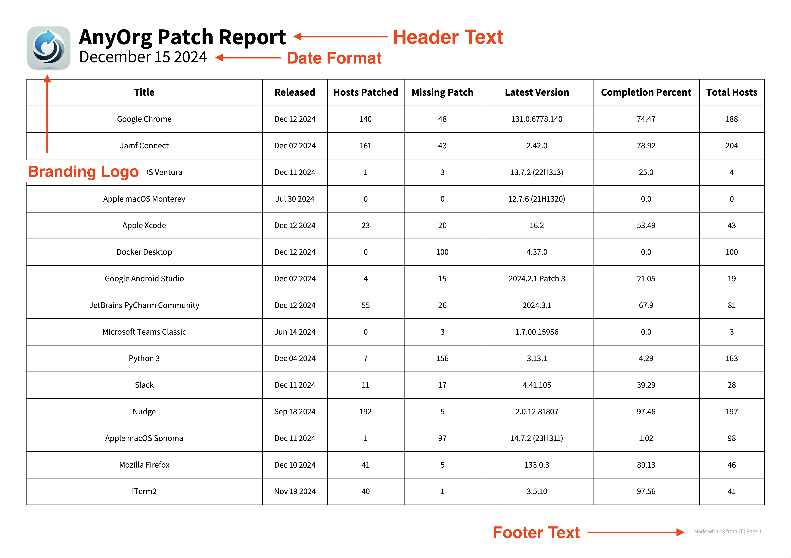

<div align="center">
    <a href="https://docs.patcherctl.dev/">
        <picture>
            <source media="(prefers-color-scheme: dark)" srcset="docs/_static/logo-dark.svg">
            <source media="(prefers-color-scheme: light)" srcset="docs/_static/logo-light.svg">
            
        </picture>
    </a>


<p align="center">
    
    Find us in the <code>#patcher</code> channel in the <a href="https://www.macadmins.org">MacAdmins Slack</a>
</p>
</div>

----

A python library and CLI for turning patch reports into something other than a spreadsheet you'll never open again. Read the full project documentation [on our project homepage](https://docs.patcherctl.dev).

<p align="center">
    
    <br>
    <sub><i>An exported PDF report for "AnyOrg". See <a href="https://docs.patcherctl.dev/en/latest/getting-started/customization.html">Customization</a> in the project docs for more.</i></sub>
</p>

## Installation

```console
$ python3 -m pip install --upgrade patcherctl
```

## Usage

Full library and CLI references plus assembled recipes live in the [Guides section](https://docs.patcherctl.dev/en/latest/guides/export.html) of the docs. The two quick examples below cover the common case of fetching Jamf's patch-management view and exporting reports.

### Library

```python
import asyncio
from patcher import PatcherClient

async def main():
    async with PatcherClient(
        client_id="...",
        client_secret="...",
        server="https://yourorg.jamfcloud.com",
    ) as patcher:
        titles = await patcher.fetch_patches()
        await patcher.export(titles, output_dir="./reports", formats={"pdf"})

asyncio.run(main())
```

### CLI

```console
$ patcherctl --client-id="..." --client-secret="..." --url="https://yourorg.jamfcloud.com" export --path="./reports" --format=pdf
```

## Patcher API

[Patcher's API](https://api.patcherctl.dev/docs) is a community catalog of macOS app patching metadata stitched from [Installomator](https://github.com/Installomator/Installomator), [Homebrew Cask](https://github.com/Homebrew/homebrew-cask), [AutoPkg](https://github.com/autopkg/autopkg) (and more) into a single queryable surface.

Read [endpoints](https://docs.patcherctl.dev/en/latest/reference/api/endpoints.html) are public, there is no authentication required. See [project docs](https://docs.patcherctl.dev/en/latest/reference/api/examples.html) for `curl` and `PatcherClient` examples.

## Contributing

[Contributions](https://docs.patcherctl.dev/en/latest/project/contributing.html) to Patcher are welcome! We have set up templates for submitting [issues](https://github.com/liquidz00/Patcher/issues/new?template=bug_report.yml), [feature requests](https://github.com/liquidz00/Patcher/issues/new?template=feature_request.yml), and [feedback](https://github.com/liquidz00/Patcher/issues/new?template=feedback.yml). Please be sure to utilize these templates when contributing to the project.

<!--
Author: Andrew Lerman
Keywords: patcher patcherctl jamf jamfpro macos installomator autopkg homebrew patch patchmanagement apple
-->
